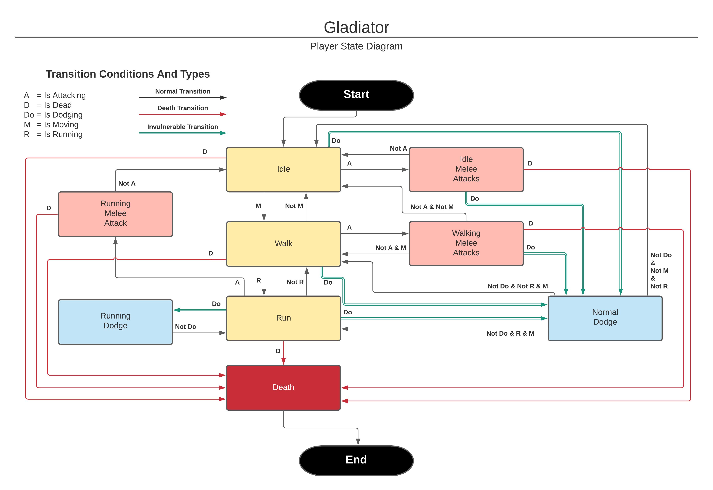

# Game Design Details

## Basic Details
1. **Camera position**: Third person
2. **Gameplay type**: Hack and slash type melee and ranged combat.
3. **Core gameplay loop**: Survive endless waves of incoming enemies as a gladiator.
4. **Enemy types**
    * Melee units
    * Ranged units
    * Boss unit
5. **Enemy drops**
    * Heal
    * Arrows
    * Damage boost
6. **Art style**: Low poly 3D

## Game Pillars
1. Fluid character movement
2. Challenging enemies and boss
3. Visual indications of health 

## Minutes of Fun
1. **Main menu**: 30 seconds
2. **Normal wave**: 60 seconds x 4
3. **Boss wave**: 180 seconds

## Player State Interactions
